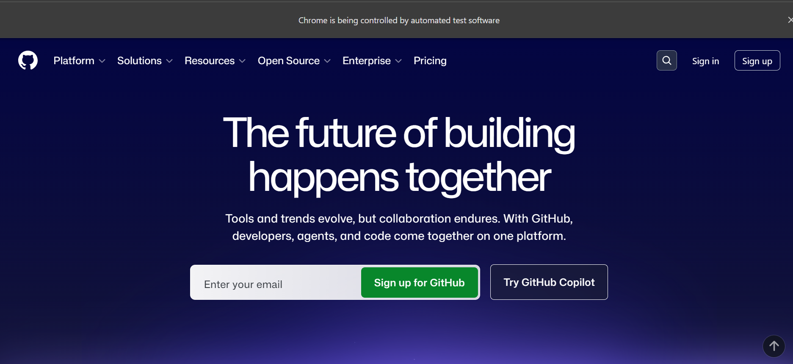
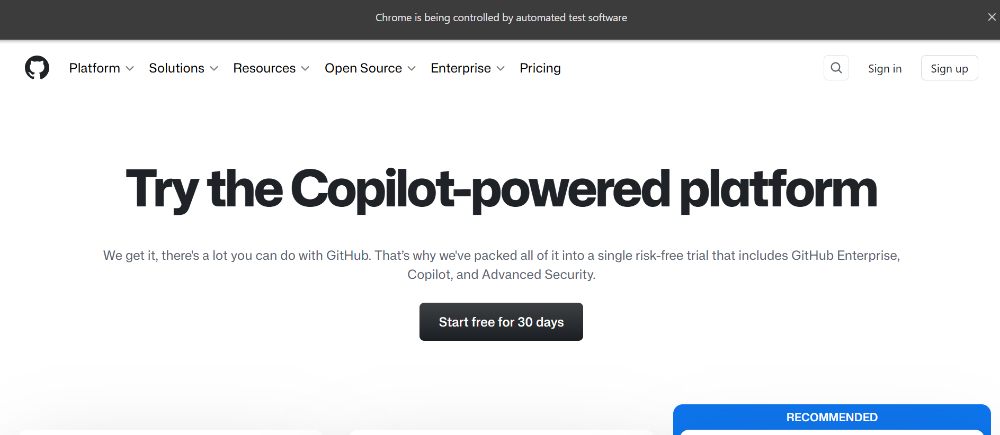

# GitHub UI Testing Automation

**Project:** GitHub UI Automation
**Framework:** Selenium WebDriver with Java (TestNG)

---

## Test Scenario 1: GitHub Homepage
**Description:** This test verifies that the GitHub homepage loads correctly.
**Steps Automated:**
1. Navigated to `https://github.com/`
2. Waited for the page to load.

---

## Test Scenario 2: GitHub Search
**Description:** This test verifies that the search functionality returns results for a given query.
**Steps Automated:**
1. Navigated to `https://github.com/search`
2. Entered "Selenium WebDriver" in the search input field.
3. Pressed the ENTER key.
4. Waited for the search results page to load.

---

## Test Scenario 3: GitHub Pricing Page
**Description:** This test verifies that the GitHub Pricing/Subscription page loads correctly.
**Steps Automated:**
1. Navigated to `https://github.com/pricing`
2. Waited for the page to load.

